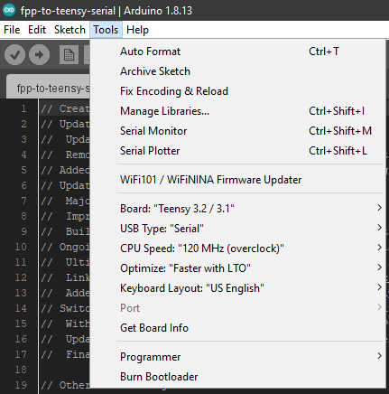
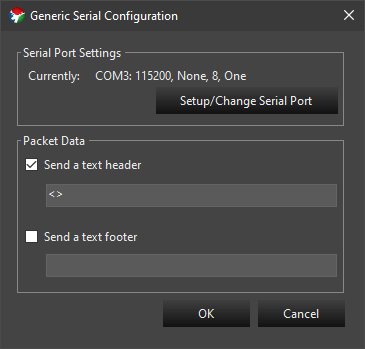
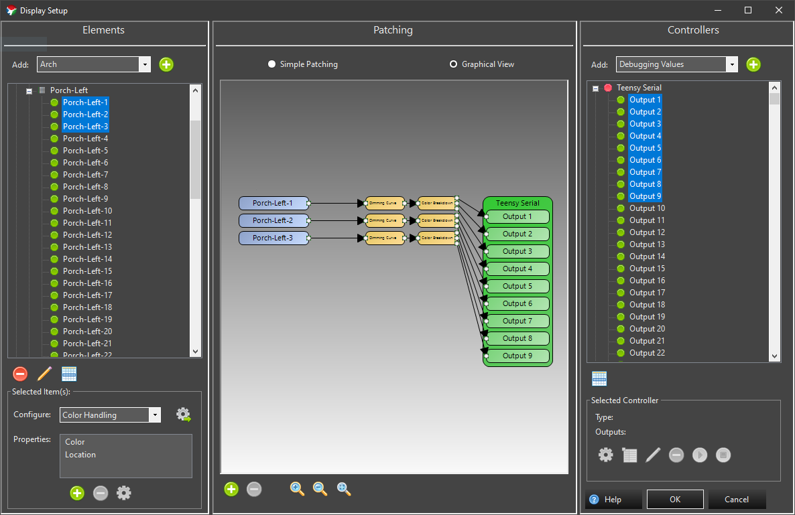

# fpp-to-teensy-serial-ws2813
Code for controlling WS2811 / WS2813 led lights with a Teensy 3.2 connected via USB/Serial to a Raspberry Pi running Falcon Player

This code is designed to get the serial data stream into the OctoWS2811's drawingMemory buffer as fast as possible.

## Config Screenshots
Options in Arduino IDE that have worked well: 

Example of Serial configuration in Vixen: 

Example of Patching configuration in Vixen: 

## Full stack from Light Sequence to LED
Windows 10 PC 
---running 
Vixen 3 (http://www.vixenlights.com/) 
---sequences created, then exported as Falcon Player Sequence to 
Raspberry Pi 3 running Falcon Pi Player, FPP 4.x (http://falconchristmas.com/forum/index.php/topic,9372.0.html) 
---connected via USB/Serial to 
Teensy 3.2 with OctoWS2811 adapter (https://www.pjrc.com/store/teensy32.html and https://www.pjrc.com/store/octo28_adaptor.html) 
---running the code here (plus the OctoWS2811 library) to control via Cat6 wire 
WS2811 & WS2813 LED Pixels 

Can also go directly from Vixen 3 to Teensy via USB/Serial.
